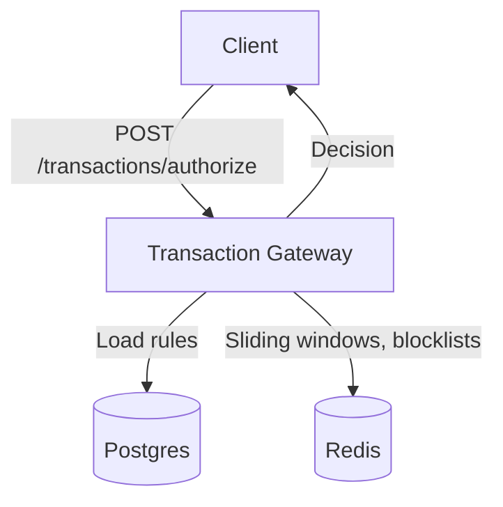

# FDS POC (Local, Synchronous Decisioning)

A minimal, **fully local** fraud decisioning gateway with dynamic rules and Redis-backed sliding windows. This project demonstrates a real-time fraud detection system for card transactions, using configurable rules and efficient state management.

## Features
- **Real-time decisioning:** Every transaction is screened instantly and allowed only if it passes all criteria.
- **Dynamic rules:** Rules can be edited and reloaded without redeploying the application.
- **Sliding windows:** Stateful rules use Redis-backed time windows for fast, atomic evaluation.
- **Dockerized:** All services run via Docker Compose for easy setup and reproducibility.

## Example Rules
- Block if location is beyond 1KM from the registered location.
- Block if total number of transactions is more than 10 in the last 5-minute window (per device).
- Block if the same card is used more than 5 times on the same device in the last 1 hour.

## Transaction Information
- Card used
- Transaction amount
- Location coordinates
- Device used to swipe the card

---


## Prerequisites
- Docker & Docker Compose
- Java 21
- Maven
- Redis 7
- PostgreSQL 16
- [jq](https://stedolan.github.io/jq/) (for demo scripts)

## Setup & Running
1. **Start all containers:**
  ```sh
  docker compose up --build -d
  ```
  (First-time pull may take a while. Wait for containers to get healthy.)

2. **Rebuild after code changes:**
  ```sh
  docker compose build --no-cache app
  docker compose up -d
  ```

3. **Check app logs:**
  ```sh
  docker compose logs -f app
  ```

4. **Load example rules:**
  ```sh
  ./scripts/add_rules.sh
  ```

5. **Send demo transactions:**
  ```sh
  ./scripts/demo_txns.sh
  ```

---


## API Endpoints

### List Rules
```sh
curl -s http://localhost:8080/rules | jq
```

### Authorize a Transaction
```sh
curl -s http://localhost:8080/transactions/authorize \
  -H 'Content-Type: application/json' \
  -d '{
    "txn_id": "t1",
    "ts": "2025-08-11T10:00:00Z",
    "card_id": "c123",
    "amount": 1499,
    "lat": 12.935,
    "lon": 77.611,
    "device_id": "d42"
  }'
```

---


## Goals (POC)
- **Sync, inline decisioning:** Each `/authorize` call gets ALLOW/BLOCK immediately.
- **Dynamic rules:** Edit rules without redeploys.
- **Low ceremony:** All services run via Docker Compose.

---


## Architecture

Synchronous gateway with in-memory rule engine + Redis windows



**Gateway responsibilities:**
- Loads active rules from Postgres (cached, hot-reload)
- Evaluates stateless rules (distance, card flags, etc)
- Evaluates stateful rules via Redis time windows (atomic Lua)
- Sets/reads blocklists in Redis (with TTL)
- Returns ALLOW/BLOCK (+ reason code)

**Data stores:**
- **Postgres:** Metadata (rules, cards/devices, registered locations)
- **Redis:** Sliding-window counters, dedupe keys, blocklists

---


## Tech Stack
- **Language:** Java 21, Spring Boot 3 (Web, Data JDBC, Actuator)
- **Store:** PostgreSQL 16 (metadata), plain tables (no PostGIS needed for POC)
- **Cache/State:** Redis 7 (Sorted Sets + Lua for sliding windows; Strings for blocklists)
- **Rule engine:** CEL (cel-java) for safe, dynamic boolean expressions
- **Build/Run:** Maven + Docker Compose

---


## Rule Model (Simple, Powerful)
Types keep evaluation clear and fast. CEL helpers allow rules to be editable text.

### 1. Geo-distance rule
```json
{
  "rule_id": "geo-1km",
  "type": "geo_distance",
  "expr": "distance_km(txn.lat, txn.lon, card.reg_lat, card.reg_lon) > params.max_km",
  "params": { "max_km": 1 },
  "action": { "decision": "BLOCK", "entity": "TRANSACTION", "reason": "GEO_DISTANCE_EXCEEDED" },
  "priority": 10, "enabled": true
}
```

### 2. Frequency by device (5 min)
```json
{
  "rule_id": "dev-10-in-5m",
  "type": "count_threshold",
  "expr": "count_in_window(key('device', txn.device_id), 'PT5M') > params.threshold",
  "params": { "threshold": 10 },
  "action": { "decision": "BLOCK", "entity": "DEVICE", "ttl": "PT1H",
               "reason": "DEVICE_TXN_RATE_EXCEEDED" },
  "priority": 20, "enabled": true
}
```

### 3. Same card on same device (1 hour)
```json
{
  "rule_id": "card-device-5-in-1h",
  "type": "count_threshold",
  "expr": "count_in_window(key('cardDevice', txn.card_id, txn.device_id), 'PT1H') > params.threshold",
  "params": { "threshold": 5 },
  "action": { "decision": "BLOCK", "entity": "DEVICE", "ttl": "PT4H",
               "reason": "CARD_DEVICE_ABUSE" },
  "priority": 30, "enabled": true
}
```

---


## How the Checks Work (Tight & Fast)
- **Geo:** Haversine formula in Java utility (`distance_km`) using doubles.
- **Blocklists:** Before evaluation, check Redis for block:device:{device_id} / block:card:{card_id}.
- **Windowed counts:**
  - Redis Sorted Sets + Lua (atomic)
  - Key examples:
    - `win:device:{device_id}` (score = epoch ms, member = txn_id)
    - `win:cardDevice:{card_id}:{device_id}`
  - Lua steps per call: ZADD now → ZREMRANGEBYSCORE older-than-window → ZCARD → return count.
  - O(logN) and single round-trip.

---


## Request Flow (Sync Decision)
1. **POST** `/transactions/authorize` with transaction JSON (+ optional Idempotency-Key).
2. **Gateway:**
   - Reject if device/card blocklist present.
   - Pull card’s registered lat/lon once (Postgres; cache by Caffeine/Redis).
   - For each enabled rule by priority:
     - Evaluate expression with helpers (CEL).
     - For `count_in_window(..)`, call the Redis Lua and get the current count.
     - On first true (violation), apply action:
       - Set block:device:{id} with TTL if action targets device.
       - Return BLOCK with reason.
3. If no rule violates → ALLOW.
4. Write a decision log to Postgres (`txn_decisions`) for audit (txn_id, decision, reason, matched_rule_id, timestamp, evaluated_counts…).

---

## Contributing
Pull requests and issues are welcome! Please open an issue to discuss major changes before submitting a PR.

## Troubleshooting
- If containers fail to start, check Docker logs and ensure ports are not in use.
- For database or Redis errors, verify connection details in `application.yaml`.
- For API errors, check the app logs for stack traces and error messages.

## License
This project is for demonstration and educational purposes. See LICENSE file for details.
